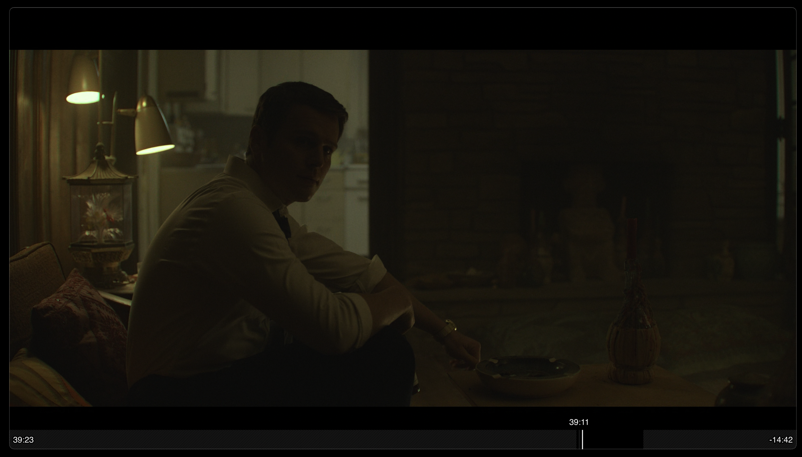

<div align="center">

# 🎬 N I T R A T E
### **The Cinephile & Audiophile Terminal Streamer**
*Direct-to-GPU 4K Dolby Vision, HDR10, and Lossless TrueHD Atmos streamed in under 2 seconds.*

<br/>

<br/>

[](https://github.com/Manteh/nitrate/releases/latest)
[](https://github.com/Manteh/nitrate/actions)
[](https://apple.com)
[](https://kernel.org)
[](https://microsoft.com)
[](https://opensource.org/licenses/MIT)

<br/>

**[⚡ Quick Install](#-1-line-zero-friction-install)** • **[💊 The Streaming Red Pill](#-the-streaming-red-pill)** • **[🖥️ Interactive TUI](#-the-interactive-terminal-experience)** • **[🛡️ Debrid Privacy](#️-how-debrid-cloud-streaming-works)** • **[⚙️ MPV Config](#️-the-audiophile--cinephile-mpv-engine)**

</div>

---

## 🖥️ The Interactive Terminal Experience

```text
 🎬 Mindhunter S01E08 (69 streams found)
   [All]  [⚡ Debrid]  [4K]  [1080p]  [720p] 
 ────────────────────────────────────────────────────────────────────────
 ❯ ⚡ [DEBRID] 4K    [DV HDR 5.1]     | 6.89 GB  | 👤 5  
      └─ Охотник за разумом.S01E08.WEB-DL.2160p.mkv
   ⚡ [DEBRID] 4K    [DV 5.1]         | 4.77 GB  | 👤 0  
      └─ Mindhunter.S01E08.2160p.NF.WEB-DL.DDP5.1.DV.HEVC.mp4
   ⚡ [DEBRID] 4K    [HDR 5.1]        | 6.88 GB  | 👤 0  
      └─ Mindhunter.S01E08.WEB-DL.2160p.HDR.mkv
   ⚡ [DEBRID] 4K    [5.1]            | 8.50 GB  | 👤 8  
      └─ Mindhunter.S01E08.2160p.NF.WEBRip.DD5.1.x264-NTb.mkv
   ⚡ [DEBRID] 4K    [5.1]            | 656.0 MB | 👤 6  
      └─ Mindhunter.S01E08.2160p.10bit.WEBRip.6CH.x265.HEVC-PSA.mkv
   ⚡ [DEBRID] 1080p [HDR 5.1]        | 1.94 GB  | 👤 0  
      └─ Mindhunter.S01E08.1080p.NF.WEB-DL.DDP5.1.HDR.H.265.mkv
   ⚡ [DEBRID] 1080p [5.1]            | 479.0 MB | 👤 135 
      └─ Mindhunter.S01E08.1080p.10bit.WEBRip.6CH.x265.HEVC-PSA.mkv
 ────────────────────────────────────────────────────────────────────────
 (1/69)   ↑/↓: Move | Enter: Play | Tab/←/→: Filter | Type: Search | q: Quit
```

<div align="center">
  
  <p><em>Direct-to-GPU 4K Dolby Vision playback in MPV (Mindhunter S01E08) — pristine shadow depth & zero compression banding</em></p>
</div>

---

## 💊 The Streaming "Red Pill"

You pay **$80+/month** across 4 different streaming subscriptions, yet:
* **Crushed Blacks & Macroblocking**: Dark scenes in *The Batman*, *House of the Dragon*, and *Mindhunter* look like a pixelated gray soup.
* **Muffled, Flat Audio**: Dynamic range is compressed down to a lossy **640 kbps stream** where explosions are deafening but dialogue is inaudible.
* **Bloated Electron Apps**: Official desktop apps consume **500MB+ RAM**, restrict web playback to 720p/1080p, and track your telemetry.

> **The Reality:** Commercial streaming platforms throttle bitrates to save millions in cloud bandwidth. You pay premium prices for heavily compressed video streams decoded by low-end web engines.

```
Visual Bitrate Teardown (4K Video Stream)
══════════════════════════════════════════════════════════════════════════════════════════════
Broadcast / Cable TV    │ █ 8 - 12 Mbps (MPEG-2/H.264 compression)
Netflix / Disney+ 4K    │ ███ 15 - 22 Mbps (Aggressive CDN compression, crushed blacks)
Apple TV+ 4K (Best Web) │ █████ 25 - 40 Mbps (Good, but still compressed)
nitrate (4K REMUX)      │ ██████████████████████════════════════════════ 80 - 125+ Mbps (RAW UHD DISC)
══════════════════════════════════════════════════════════════════════════════════════════════

Audio Dynamic Range & Fidelity
══════════════════════════════════════════════════════════════════════════════════════════════
Commercial Streaming (E-AC-3) │ █ 448 - 768 kbps (Lossy compressed, squashed dynamic range)
nitrate (TrueHD / DTS-HD MA)  │ ██████████████════════════════════ 4,500 - 9,200+ kbps (LOSSLESS MASTER)
══════════════════════════════════════════════════════════════════════════════════════════════
```

---

## ⚡ The Ultimate Showdown

| Feature | 🚫 Commercial Streaming *(Netflix/Disney)* | ⚠️ Old-School Torrenting *(qBittorrent/VPN)* | 👑 `nitrate` *(Debrid + MPV)* |
| :--- | :--- | :--- | :--- |
| **Monthly Cost** | **$80 – $100+/mo** *(across 4-5 apps)* | $5–$10/mo *(VPN subscription)* | **~$3/mo** *(Debrid cloud cache)* |
| **4K Video Bitrate** | 15 – 25 Mbps *(compressed)* | 80 – 120 Mbps | **80 – 120+ Mbps (Raw UHD Master)** |
| **Audio Quality** | Compressed Lossy E-AC-3 | Lossless *(after 40 min download)* | **Instant Lossless TrueHD Atmos / DTS-HD** |
| **Start Time** | Instant *(low quality)* | 20 – 60 min download | **⚡ Under 1.5 Seconds (Instant)** |
| **ISP / DMCA Safety** | Safe | ❌ Risky *(IP exposed if VPN drops)* | **🔒 100% Safe (Encrypted HTTPS CDN)** |
| **VPN Required?** | No | **Yes (Mandatory)** | **No (Zero VPN needed)** |
| **Rendering Engine** | Browser / Electron web player | Basic player | **Direct-to-GPU (`libplacebo` / `gpu-next`)** |
| **Platforms** | OS specific web / app limits | OS specific apps | **macOS, Linux & Windows (Universal)** |
| **Disk & RAM Footprint** | 500 MB – 1.5 GB+ RAM *(Electron)* | 100 MB App + Background Daemons | **<35KB CLI + Native MPV C-engine (~150MB disk, ~45MB RAM)** |
| **Catalog** | Fragmented & disappearing monthly | Large | **Everything ever made in cinema history** |

---

## 🛡️ How Debrid Cloud Streaming Works

When you use `nitrate` with a Debrid service ([TorBox](https://torbox.app) or [Real-Debrid](https://real-debrid.com), ~$3/mo):

```
 ┌──────────────────────────────────────────────────────────────┐
 │               HIGH-SPEED DEBRID CLOUD CLUSTER                │
 │    Multi-Gigabit Datacenter • 95%+ Releases Pre-Cached       │
 └──────────────────────────────┬───────────────────────────────┘
                                │
                                │ 🔒 Encrypted Direct HTTPS Stream (TLS 1.3)
                                │    • ZERO P2P / ZERO Seeding from your IP
                                │    • ISP sees only standard HTTPS web traffic
                                ▼
 ┌──────────────────────────────────────────────────────────────┐
 │              YOUR MACHINE (Mac / Linux / Windows)            │
 │                 `nitrate` ──► `mpv` Player                   │
 └──────────────────────────────┬───────────────────────────────┘
                                │
               ┌────────────────┴────────────────┐
               ▼                                 ▼
   GPU Hardware Decoding             Lossless Bitstream Audio
   • Metal / Direct3D11 / Vulkan     • Dolby TrueHD / Atmos
   • 10-bit Dolby Vision Tone-Map    • DTS-HD Master Audio (9.2 Mbps)
   • EWA Lanczos Chroma Upscaling    • Direct to DAC / Soundbar
```

1. **100% ISP Safety (No VPN Needed)**: You **never** connect to torrent swarms or seeders directly. Debrid servers download and cache the file on secure cloud servers. You stream over an **encrypted HTTPS connection**.
2. **Instant Playback (Zero Buffering)**: Popular releases are **already pre-cached** on multi-gigabit CDNs. Seeking forward 45 minutes into an 80GB 4K file happens **instantly with zero lag**.
3. **Never Worry About Dead Torrents**: Maximum line speed 24/7 without depending on slow peers.

---

## ⚡ 1-Line Zero-Friction Install

No manual config file editing. No python dependency hell.

### 🍎 macOS & 🐧 Linux *(Terminal)*
```bash
bash -c "$(curl -fsSL https://raw.githubusercontent.com/Manteh/nitrate/main/install.sh)"
```

### 🪟 Windows *(PowerShell)*
```powershell
irm https://raw.githubusercontent.com/Manteh/nitrate/main/install.ps1 | iex
```

### 🪄 What the Installer Does Automatically:
1. **Installs `mpv`** automatically via Homebrew (macOS), package manager (Linux), or `winget` (Windows).
2. **Auto-Configures Studio-Grade `mpv.conf`**: Enables 10-bit Dolby Vision rendering (`libplacebo` / `gpu-next`), debrid network caching, and English audio/subtitle defaults.
3. **Installs Binary to `$PATH`**: Sets up `nitrate` so it is callable from anywhere.
4. **Interactive Debrid Onboarding**: Asks for your TorBox or Real-Debrid API key with direct setup links, or enables free P2P mode.

---

## 🚀 How to Use

### 1. Stream Any Movie or Show
```bash
nitrate "Mindhunter"
nitrate "Dune: Part Two"
nitrate "Arcane" -s 1 -e 3
```

### 2. Resume Watching (Home Menu)
Run `nitrate` with no arguments to see your recent watch list and quick search:
```bash
nitrate
```

### 3. Seek to Timestamp (e.g. Last 10 Minutes)
```bash
nitrate "Inception" -t -10:00
```

### 4. Update Debrid API Key Anytime
```bash
nitrate --config
```

---

## 🖥️ Keyboard Navigation & Shortcuts

```text
 ┌──────────────────────────────────────────────────────────────┐
 │  ↑ / ↓  or  k / j   : Move cursor up / down                  │
 │  Enter              : Select Title / Season / Episode        │
 │  Tab / ← / →        : Switch Quality Tabs (All/Debrid/4K/1080p)│
 │  Type any letters   : Instant live fuzzy search / filter     │
 │  Backspace          : Delete search filter                   │
 │  PageUp / PageDown  : Jump 8 items at a time                 │
 │  q / Esc            : Go back or quit cleanly                │
 └──────────────────────────────────────────────────────────────┘
```

---

## ⚙️ The Audiophile & Cinephile `mpv` Engine

The installer automatically writes this optimal configuration to `~/.config/mpv/mpv.conf` (or `%APPDATA%\mpv\mpv.conf` on Windows) for mathematically exact rendering:

```ini
# Studio-grade GPU video rendering (libplacebo)
vo=gpu-next
hwdec=auto-safe

# High-speed Debrid network buffering (512MB RAM cache)
cache=yes
demuxer-max-bytes=512MiB
network-timeout=60

# Audio & Subtitle Defaults (English first, no auto-foreign dubs)
alang=en,eng,lit,lt
slang=en,eng,lit,lt
subs-with-matching-audio=no

# UI & Controls
force-window=immediate
script-opts=osc-layout=bottombar
```

---

## 💬 Frequently Asked Questions

<details>
<summary><b>Is this legal and safe from ISP notices?</b></summary>
When using a Debrid service (TorBox / Real-Debrid), you are <b>not torrenting or seeding from your home IP</b>. The Debrid servers download the content to their secure datacenters, and you stream it over an encrypted <code>https://</code> tunnel directly to mpv. Your ISP only sees standard HTTPS web traffic.
</details>

<details>
<summary><b>Why is mpv better than VLC, Plex, or web browsers?</b></summary>
Web browsers and desktop Electron apps limit video output to 8-bit color, sRGB, and lossy audio codecs with zero native support for Dolby Vision tone mapping. VLC frequently clips HDR highlights or oversaturates colors. <code>mpv</code> powered by <code>libplacebo</code> is the gold standard used by video engineers for mathematically accurate color science, dynamic HDR tone-mapping, and bit-exact audio passthrough.
</details>

<details>
<summary><b>What if I don't have a Debrid account?</b></summary>
<code>nitrate</code> will automatically fall back to standard P2P streaming using WebTorrent or local Stremio Engine. However, getting a Debrid key (~$3/mo) is strongly recommended for instant seeking and zero buffering.
</details>

---

<div align="center">

### Crafted for cinephiles, audiophiles, and terminal minimalists.

Distributed under the **MIT License**.

⭐ **Star this repository if you love uncompressed cinema!**

</div>
